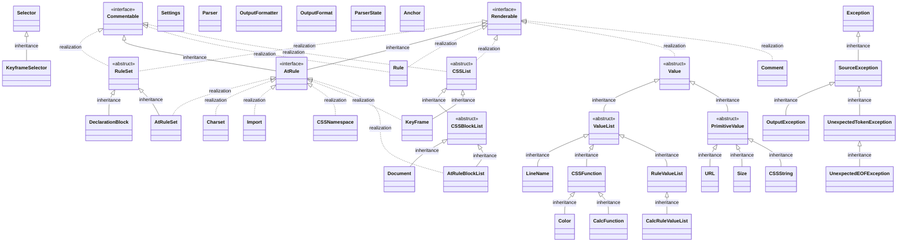

```mermaid
classDiagram
    class Renderable {
        <<interface>>
    }
    class DeclarationBlock {
    }
    class RuleSet {
        <<abstruct>>
    }
    class AtRuleSet {
    }
    class KeyframeSelector {
    }
    class AtRule {
        <<interface>>
    }
    class Charset {
    }
    class Import {
    }
    class Selector {
    }
    class CSSNamespace {
    }
    class Settings {
    }
    class Rule {
    }
    class Parser {
    }
    class OutputFormatter {
    }
    class OutputFormat {
    }
    class OutputException {
    }
    class UnexpectedEOFException {
    }
    class SourceException {
    }
    class UnexpectedTokenException {
    }
    class ParserState {
    }
    class Anchor {
    }
    class CSSBlockList {
        <<abstruct>>
    }
    class Document {
    }
    class CSSList {
        <<abstruct>>
    }
    class KeyFrame {
    }
    class AtRuleBlockList {
    }
    class Color {
    }
    class URL {
    }
    class CalcRuleValueList {
    }
    class ValueList {
        <<abstruct>>
    }
    class CalcFunction {
    }
    class LineName {
    }
    class Value {
        <<abstruct>>
    }
    class Size {
    }
    class CSSString {
    }
    class PrimitiveValue {
        <<abstruct>>
    }
    class CSSFunction {
    }
    class RuleValueList {
    }
    class Commentable {
        <<interface>>
    }
    class Comment {
    }

    RuleSet <|-- DeclarationBlock: inheritance
    Renderable <|.. RuleSet: realization
    Commentable <|.. RuleSet: realization
    RuleSet <|-- AtRuleSet: inheritance
    AtRule <|.. AtRuleSet: realization
    Selector <|-- KeyframeSelector: inheritance
    Renderable <|-- AtRule: inheritance
    Commentable <|-- AtRule: inheritance
    AtRule <|.. Charset: realization
    AtRule <|.. Import: realization
    AtRule <|.. CSSNamespace: realization
    Renderable <|.. Rule: realization
    Commentable <|.. Rule: realization
    SourceException <|-- OutputException: inheritance
    UnexpectedTokenException <|-- UnexpectedEOFException: inheritance
    Exception <|-- SourceException: inheritance
    SourceException <|-- UnexpectedTokenException: inheritance
    CSSList <|-- CSSBlockList: inheritance
    CSSBlockList <|-- Document: inheritance
    Renderable <|.. CSSList: realization
    Commentable <|.. CSSList: realization
    CSSList <|-- KeyFrame: inheritance
    AtRule <|.. KeyFrame: realization
    CSSBlockList <|-- AtRuleBlockList: inheritance
    AtRule <|.. AtRuleBlockList: realization
    CSSFunction <|-- Color: inheritance
    PrimitiveValue <|-- URL: inheritance
    RuleValueList <|-- CalcRuleValueList: inheritance
    Value <|-- ValueList: inheritance
    CSSFunction <|-- CalcFunction: inheritance
    ValueList <|-- LineName: inheritance
    Renderable <|.. Value: realization
    PrimitiveValue <|-- Size: inheritance
    PrimitiveValue <|-- CSSString: inheritance
    Value <|-- PrimitiveValue: inheritance
    ValueList <|-- CSSFunction: inheritance
    ValueList <|-- RuleValueList: inheritance
    Renderable <|.. Comment: realization
```
